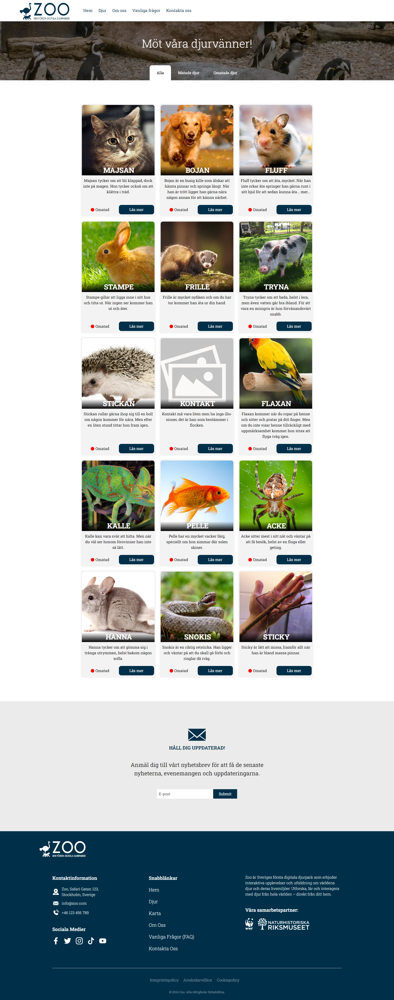
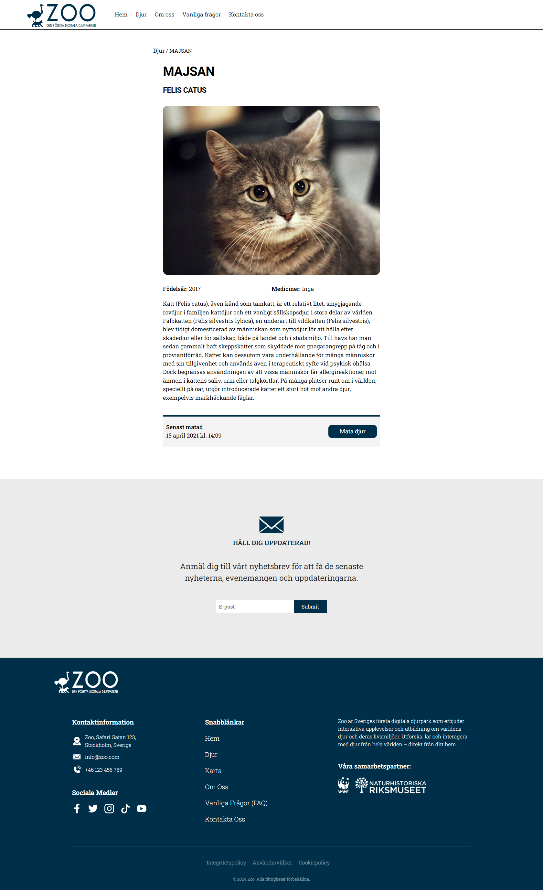
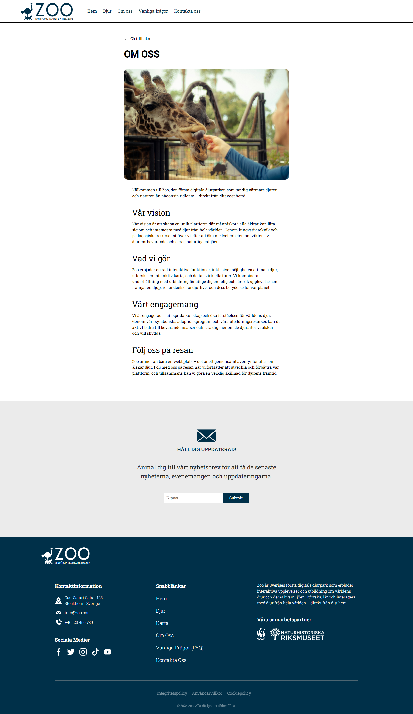
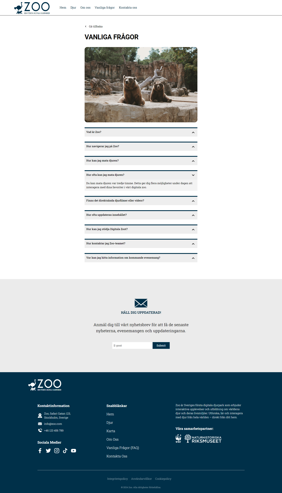
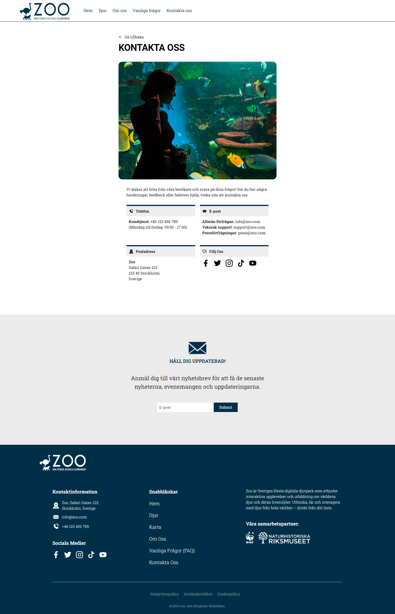

    👨🏻‍🎓 Front End Developer student at 
    <a 
        href="https://medieinstitutet.se/"
        style=
        "
            color: #A8A8A8;
            font-weight: none;
            text-decoration: underline;
        "
    >
    medieinstitutet</a>!

## 🔧 Repository Status

This repository is currently undergoing editing and may not be in its final state. Please check back later for updates.

## 📖 About the project

The objective of this assignment was to create a SPA (Single Page Application) with help of React library. The application must meet the following requirements:
<ul>
   <li>The user will be able to see all the animals.</li>
   <li>The user will be able to feed an animal. If an animal has been fed, the user will have to wait three hours before feeding it again.</li>
   <li>The user will be able to click on an animal to read more information about it.</li>
   <li>The project should have a well-organized structure and files.</li>
   <li>We will handle broken images (images that do not load correctly) by displaying a placeholder image.</li>
   <li>After three hours have passed, a reset will occur, allowing the user to feed the animal again.</li>
   <li>The project must use at least one service to fetch data from an API.</li>
</ul>

The given time to complete this assignment was six days.

    <a href="#read_me_top">[ back to top ⇡ ]</a>

## 🗂️ Learning objectives & assessment

<ul>
    <li>Identify bugs (both in code & in network communication)</li>
    <li>Troubleshoot and fix bugs</li>
    <li>Creation of SPA (Single Page Application) with React</li>
    <li>Routing</li>
    <li>Loaders</li>
</ul>

    <a href="#read_me_top">[ back to top ⇡ ]</a>

## ✨ Features

### **Animals page**

The user can visit the Animals page to see all the animals. On this page, there are three categories to choose from:

1. All animals ( Displays every animal in the zoo )
2. Animals that have been fed ( Shows only the animals that have been fed )
3. Animals that have not been fed ( Lists the animals that have not been fed )

Additionally, the fed status of each animal is clearly displayed on the Animals page, allowing users to easily see which animals have been fed and which have not.

### **Read more**

The user can learn more about a specific animal by clicking on the "Read More" button. When this button is clicked, detailed information about the selected animal is displayed.

### **Feeding the animals**

The user has the option to feed the animal on its information page. If the animal has already been fed, the "Feed" button will be disabled, preventing the user from feeding it again. However, after three hours have passed, the user will have the opportunity to feed the animal again.

### **Project Structure and Error Handling**

- The project has a well-organized structure with properly organized files.
- Broken images (images that do not load correctly) are handled gracefully by displaying a placeholder image.

    <a href="#read_me_top">[ back to top ⇡ ]</a>

## 📷 Screenshots

The images below are displayed in a smaller size to make it easier to follow the content of this file. To view the full-size images, simply open them in a new window.

    
    
    
    
    
       

    <a href="#read_me_top">[ back to top ⇡ ]</a>

## ⚙️ Build tools

    <a href="#read_me_top">[ back to top ⇡ ]</a>

## 👨‍💼 Author

    Nikolaos Sarris

  

    Publish year: 2024

    <a href="#read_me_top">[ back to top ⇡ ]</a>

